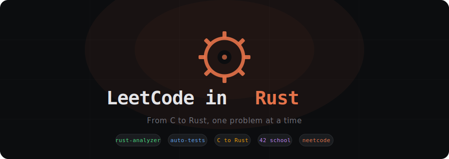

<p align="center">
  
</p>

A local workspace for solving LeetCode problems in Rust with full IDE support (rust-analyzer), solution archiving, and progress tracking. Built for 42 school students learning Rust from C.

---

## Requirements

Install the Rust toolchain if you don't have it:

```bash
curl --proto '=https' --tlsv1.2 -sSf https://sh.rustup.rs | sh
```

Recommended: `cargo-watch` for live test feedback — `cargo install cargo-watch`

## Install

```bash
git clone https://github.com/ihibti/leetcode-rust.git
cd leetcode-rust
```

## Solve a Problem

```bash
# Fetch the problem — generates the impl skeleton and test cases
cargo solve https://leetcode.com/problems/two-sum/

# Open src/solution.rs and fill in your solution
# Tests auto-rerun on save with cargo-watch
cargo watch -x test

# When you're done, save it to your archive
# Difficulty and tags are auto-filled from LeetCode — just pass the name
cargo archive two-sum

# You can still override with flags if needed
cargo archive two-sum -r "HashMap,entry-api"   # add Rust concepts you practiced

# See your stats
cargo progress
```

## Commands

| Command | Description |
|---|---|
| `cargo solve <url>` | Fetch problem from LeetCode, generate impl skeleton and tests |
| `cargo solve` | Start with a blank template (no URL) |
| `cargo solve --force` | Overwrite solution.rs without confirmation |
| `cargo archive <name>` | Save current solution (difficulty and tags auto-filled from LeetCode, optional: `-r` rust concepts) |
| `cargo progress` | Show solving stats and progress |
| `cargo watch -x test` | Auto-run tests on file changes |

## Workflow

```
cargo solve <url> → edit solution.rs → cargo watch -x test → cargo archive <name>
        ↑                                                            |
        └────────────────────────────────────────────────────────────┘
```

When you run `cargo solve <url>`, it fetches the problem from LeetCode, generates the `impl Solution` skeleton and test cases from the examples. Open `src/solution.rs` — the method signature and tests are ready, just fill in the implementation.

When you archive, difficulty and tags are automatically pulled from the LeetCode data. You only need to pass the problem name.

## rust-analyzer Setup

rust-analyzer gives you completions, docs on hover, inline type hints, and compiler errors in your editor. You need to install it for your editor.

**VS Code:**
1. Install the [rust-analyzer extension](https://marketplace.visualstudio.com/items?itemName=rust-lang.rust-analyzer)
2. **Open VS Code at the repo root** (`code .` from `leetcode-rust/`) — rust-analyzer needs to find `Cargo.toml` at the top level to work correctly
3. It activates automatically once the workspace is open

**Neovim:**
1. Install rust-analyzer: `rustup component add rust-analyzer`
2. Your LSP config should pick it up (if using nvim-lspconfig, it works out of the box)
3. Open Neovim from the repo root so it finds `Cargo.toml`

## Project Structure

```
leetcode-rust/
├── src/
│   ├── lib.rs           # Crate root
│   ├── solution.rs      # YOUR WORKING FILE
│   ├── types.rs         # ListNode, TreeNode
│   └── macros.rs        # list![], tree![] test helpers
├── xtask/               # CLI tooling (solve, archive, progress)
├── archive/             # Your solved problems
└── docs/
    ├── fundamentals.md  # Rust syntax quick reference (for C programmers)
    ├── cheatsheet.md    # C-to-Rust patterns in depth
    ├── resources.md     # Learning resources + neetcode roadmap
    └── ai-tutor.md      # Setting up AI assistance
```

## Documentation

- **[Fundamentals](docs/fundamentals.md)** — "What does `::` mean?" Quick answers to Rust syntax that surprises C programmers
- **[Cheatsheet](docs/cheatsheet.md)** — Side-by-side C and Rust patterns for LeetCode
- **[Resources](docs/resources.md)** — Curated learning resources + neetcode problem roadmap
- **[AI Tutor](docs/ai-tutor.md)** — Set up Claude Code or other AI tools as your Rust tutor

## Credits

Shoutout to [Idrissa](https://github.com/iibabyy) for getting me into Rust.
